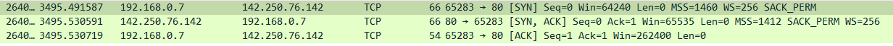
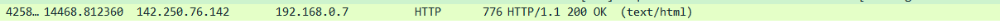
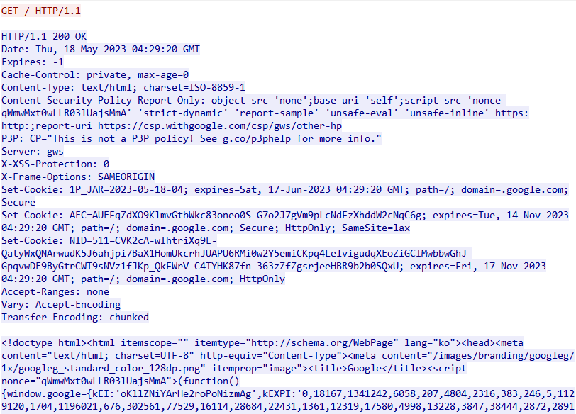

# Quest 06. 인터넷의 이해

## Introduction

* 이번 퀘스트에서는 인터넷이 어떻게 동작하며, 서버와 클라이언트, 웹 브라우저 등의 역할은 무엇인지 알아보겠습니다.

## Topics

* 서버와 클라이언트, 그리고 웹 브라우저
* 인터넷을 구성하는 여러 가지 프로토콜
  * IP
  * TCP
  * HTTP
* DNS

## Resources

* [OSI 모형](https://ko.wikipedia.org/wiki/OSI_%EB%AA%A8%ED%98%95)
* [IP](https://ko.wikipedia.org/wiki/%EC%9D%B8%ED%84%B0%EB%84%B7_%ED%94%84%EB%A1%9C%ED%86%A0%EC%BD%9C)
  * [Online service Traceroute](http://ping.eu/traceroute/)
* [TCP](https://ko.wikipedia.org/wiki/%EC%A0%84%EC%86%A1_%EC%A0%9C%EC%96%B4_%ED%94%84%EB%A1%9C%ED%86%A0%EC%BD%9C)
  * [Wireshark](https://www.wireshark.org/download.html)
* [HTTP](https://ko.wikipedia.org/wiki/HTTP)
  * Chrome developer tool, Network tab
* [DNS](https://ko.wikipedia.org/wiki/%EB%8F%84%EB%A9%94%EC%9D%B8_%EB%84%A4%EC%9E%84_%EC%8B%9C%EC%8A%A4%ED%85%9C)
  * [Web-based Dig](http://networking.ringofsaturn.com/Tools/dig.php)

## Checklist

* 인터넷은 어떻게 동작하나요? Internet Protocol Suite의 레이어 모델에 입각하여 설명해 보세요.

  데이터 전송 시, 애플리케이션 계층 -> 전송 계층 -> 인터넷 계층 -> 네트워크 계층으로 이동하며 계층 이동마다 헤더가 추가되는데 이를 캡슐화라고 한다. 데이터 수신 시에는 반대 방향으로 진행하며 계층 이동마다 헤더를 읽고 알맞은 행동을 한 뒤, 헤더를 제거한다. 이를 역캡슐화라고 한다.

  애플리케이션 계층에서는 화면에 필요한 데이터를 요청하기 위해 데이터를 생성한다. 전송 계층에서는 애플리케이션 계층으로부터 받은 데이터를 조각내어 출발지와 도착지의 포트번호가 담긴 TCP패킷을 붙여 인터넷 계층으로 전달한다. 인터넷 계층에서는 출발지와 목적지의 IP주소가 담긴 IP헤더를 붙여 네트워크 계층으로 보내고, 네트워크 계층에서는 물리주소인 MAC주소(출발지, 목적지)를 참조해 알맞은 기기로 데이터를 전달한다. 

  * 근거리에서 서로 떨어진 두 전자기기가 유선/무선으로 서로 통신하는 프로토콜은 어떻게 동작할까요?

    유선통신의 경우, 이더넷을 많이 사용한다. 프레임을 전송하기 전에 현재 전송되고 있는 프레임이 있는 지 확인하고, 전송 중이라면 기다리고 아니라면 전송을 시작한다. 여러 군데에서 동시에 전송을 시작해 충돌이 발생하면 최소 패킷 시간 동안 전송을 계속해, 다른 컴퓨터가 해당 컴퓨터를 탐지할 수 있도록한다. 전송을 마치거나, 실패 시 이를 상위 계층에 알린다. 

    무선으로는 IEE 802.11로 흔히 와이파이라고 불리는 프로토콜이 존재한다. 공유기는 케이블선과 연결되어 ISP로부터 공인 IP주소를 부여받고, 연결된 기기에는 공유기가 사설 IP주소를 할당한다. NAT 기능을 통해 사설IP를 공인IP로 변경하여 외부 네트워크와 통신할 수 있도록 하고, PAT기능을 통해서는 기기에 포트번호를 부여해 다시 돌아올 때 포트번호를 통해 공유기에 연결된 여러 기기 중 해당 포트번호를 가진 기기에 돌아올 수 있도록 한다. 

  * 근거리에 있는 여러 대의 전자기기가 서로 통신하는 프로토콜은 어떻게 동작할까요?
  * 아주 멀리 떨어져 있는 두 전자기기가 유선/무선으로 서로 통신하는 프로토콜은 어떻게 동작할까요?
  * 두 전자기기가 신뢰성을 가지고 통신할 수 있도록 하기 위한 프로토콜은 어떻게 동작할까요?

    TCP 헤더에는 오류를 체크하는 checksum이 존재한다. 송신자는 checksum 계산 알고리즘에 의해 계산한 체크섬을 헤더에 삽입하여 송신하고, 수신자는 동일 알고리즘으로 수신받은 데이터를 검사해 봄으로써 오류여부를 확인한다. 잘못 보내졌을 경우 ACK Flag를 reset(0)하여 보내고, 제대로 보낸 경우에는 set(1)하고 acknowlegment number에 수신자가 받았던 sequence number에 1을 더해 값을 보낸다. 만약, 응답 패킷을 받지 못했다면 패킷을 다시 보냄으로써 신뢰성을 보장한다. 또한, 일정 시간동안 ACK(Positive Acknowledge) 또는 NAK(Negative Acknowledge)가 오지 않았다면 TIMEOUT된 시점에서 다시 TCP 세그먼트를 보낸다. 
  * HTTP는 어떻게 동작할까요?

    HTTP는 클라이언트-서버 프로토콜이자 하이퍼텍스트 전송 프로토콜이다. 클라이언트가 서버에 요청을 보내면 서버는 해당 요청에 맞는 결과를 찾아서 사용자에게 응답한다. 이때 요청의 내용이란 HTTP 메서드, URL, HTTP 버전 유형, HTTP 요청 헤더, 선택 사항인 HTTP본문이며 일반적인 응답에는 HTTP 상태코드, HTTP응답 헤더, 선택 사항인 HTTP 본문을 의미한다.
* 우리가 브라우저의 주소 창에 www.knowre.com 을 쳤을 때, 어떤 과정을 통해 서버의 IP 주소를 알게 될까요?

  컴퓨터 내부에 등록 되어 있는 DNS서버로 www.knowre.com 에 해당하는 IP주소를 받아낸다. 이후 브라우저는 IP주소로 접속하여 웹사이트가 보이게 된다.

## Quest

* tracert(Windows가 아닌 경우 traceroute) 명령을 통해 www.google.com 까지 가는 경로를 찾아 보세요.
  * 어떤 IP주소들이 있나요?
  * 그 IP주소들은 어디에 위치해 있나요?
   
    ...(생략)...
 
    7: 112.174.84.2: 경기도 성남시 분당구 불정로 90
    
    ...(생략)...
  
    15: 142.250.206.228: 미국, 캘리포니아주, Mountain View, 1600 Amphitheatre Parkway
* Wireshark를 통해 www.google.com 으로 요청을 날렸을 떄 어떤 TCP 패킷이 오가는지 확인해 보세요

  
  * TCP 패킷을 주고받는 과정은 어떻게 되나요?

    클라이언트(ip주소: 192.168.0.7)에서 구글(ip주소: 142.250.76.142)로 통신을 원한다는 신호를 보냅니다. ([SYN] Seq=0)
    구글에서 SYN을 정상적으로 받았다는 신호를 보냅니다. ([SYN, ACK] Seq=0 Ack=1)
    클라이언트에서 SYN-ACK를 잘 받았다는 신호를 보냅니다. ([ACK] Seq=1 Ack=1)
  * 각각의 패킷에 어떤 정보들이 담겨 있나요?

    Source Port와 Destination Port가 보여지고, Squence Number(순차 번호 필드)로 세그먼트에 대한 식별값을 제공한다. 
* telnet 명령을 통해 <http://www.google.com/> URL에 HTTP 요청을 날려 보세요.

  
  
  * 어떤 헤더들이 있나요?

    HTTP는 클라이언트가 서버에 요청하는 것과 서버가 클라이언트로 답변하는 경우로 나눌 수 있으며 이로 인해 공통헤더, 요청헤더, 응답헤더, 엔티티헤더가 존재한다.
  * 그 헤더들은 어떤 역할을 하나요?

    공통헤더는 요청 및 응답의 메시지 모두에서 사용되는 헤더로 시간을 알려주는 Date, 캐시 제어를 나타내는 Cache-Control 등이 존재한다. 요청헤더는 서버로 요청할 데이터의 정보가 담겨 있다. Host, Cookie, 클라이언트 프로그램 정보인 User-agent 등이 있다. 응답헤더는 위치나 서버 자체에 대한 정보를 갖는 헤더이다. Location, Server, Age 등이 존재한다.엔티티헤더는 Entity Body에  대한 정보를 담고 있다. 
## Advanced

* (선택사항) HTTP의 최신 버전인 HTTP/3는 어떤 식으로 구성되어 있을까요?
* (선택사항) TCP/IP 외에 전세계적인 네트워크를 구성하기 위한 다른 방식도 제안된 바 있을까요?
